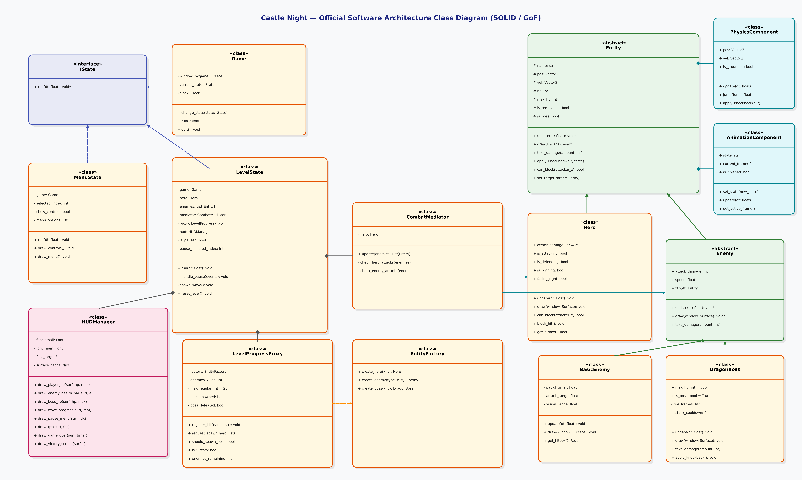

<div align="center">


# 🏰 Castle Night — 2D Metroidvania Demo

**Padrões de Engenharia de Software, Arquitetura SOLID e Boas Práticas em Python & Pygame**

[](https://www.python.org/)
[](https://www.pygame.org/)
[](#-padrões-de-projeto-design-patterns)
[](./LICENSE)

</div>

<br/>

**Castle Night** é uma demonstração jogável de ação e combate 2D em estilo Metroidvania desenvolvida em **Python** e **Pygame**. O projeto foi concebido originalmente como desafio acadêmico no curso de **Bacharelado em Engenharia de Software (Uninter)** para a disciplina de *Linguagem de Programação Aplicada*, recebendo nota máxima (**100/100**) e sendo continuamente aprimorado com padrões de engenharia de produção.

---

## 🏛️ Padrões de Projeto (Design Patterns & SOLID)

A arquitetura do projeto foi estruturada com foco em **baixo acoplamento**, **alta coesão** e **responsabilidade única (SRP)**:

* **State Pattern (`src/core/states.py`):**
  Orquestração desacoplada das telas do jogo (`MenuState`, `LevelState`). Garante isolamento de contexto, controle de eventos, facilidade de expansão de novas fases e *garbage collection* determinístico.
* **Proxy Pattern (`src/core/proxy.py`):**
  A classe `LevelProgressProxy` atua como intermediária de progressão, controlando a contagem de baixas da horda (20 inimigos), alternância de lados de surgimento e o disparo da batalha contra o `DragonBoss`.
* **Mediator Pattern (`src/core/mediator.py`):**
  Centralização da resolução de combate com `CombatMediator`. O `Hero` e os `Enemies` não possuem acoplamento direto; o mediador avalia colisões AABB (*Axis-Aligned Bounding Box*), aplica dano dinâmico e delega defesas e repulsões via métodos de domínio (`apply_knockback`, `can_block`).
* **Factory Method Pattern (`src/entities/factory.py`):**
  A `EntityFactory` encapsula a instanciação de entidades (`Hero`, `BasicEnemy`, `DragonBoss`), injetando atributos, velocidades, limites de visão e catálogos de sprites dinamicamente.
* **Component / Composition Pattern (`src/entities/components.py`):**
  Substituição de herança pesada por composição reutilizável:
  * `PhysicsComponent`: Gerenciamento de vetores contínuos (`Vector2`), gravidade, salto e colisão com o solo.
  * `AnimationComponent`: Controle de avanço de quadros por delta time (`dt`), taxas de playback, looping e estados de finalização.
* **Layered UI Decoupling (`src/ui/hud.py`):**
  Isolamento completo da interface gráfica no `HUDManager`. Pré-alocação estática de fontes e superfícies translúcidas em cache para garantir zero *Garbage Collection overhead* e estabilidade cravada em **60 FPS**.
* **Flyweight / In-Memory Cache (`src/utils/asset_loader.py`):**
  Carregamento e cache único de imagens e áudios na memória para mitigar gargalos de I/O em tempo de execução.

---

## 🎮 Mecânicas e Funcionalidades

- **⚔️ Combate Preciso:**
  - *Ataque em Caminhada:* Ao andar (`A`/`D`) e desferir um golpe, o Herói para no lugar e ataca virado para a direção correta.
  - *Dash Attack:* Segurar `Shift` (corrida) e atacar executa a investida veloz em movimento.
  - *Defesa com Escudo:* Pressione `C` para erguer o escudo e anular 100% dos danos frontais recebidos.
- **🐉 Boss Fight com Super-Armor:**
  - O `DragonBoss` possui *Super-Armor* (imunidade a stagger/hit-stun) e imunidade a knockback, mantendo seus ciclos de ataque e baforadas de fogo sem interrupções.
- **⏸️ Sistema de Pause In-Game:**
  - Pressionar `ESC` durante a partida congela instantaneamente a física, animações e timers, exibindo um menu medieval com opções interativas (*"Continuar"* e *"Voltar ao Menu Principal"*).
- **🩸 Barras de Vida Flutuantes:**
  - Barras compactas de HP renderizadas em pixel art sobre a cabeça de cada inimigo comum ativo.
- **🎨 Interface Medieval 8-Bit:**
  - Menu principal dinâmico com navegação por teclado e mouse, modal de controles estilizado e HUD de alto contraste.

---

## 🕹️ Guia de Controles

| Comando | Tecla / Ação | Descrição |
| :--- | :--- | :--- |
| **Mover para Esquerda / Direita** | `A` / `D` ou `←` / `→` | Movimentação horizontal do herói |
| **Pular** | `Espaço` (`Space`) | Salto vertical com física de gravidade |
| **Correr** | `Left Shift` | Acelera a velocidade de movimento |
| **Bloquear / Defender** | `C` | Ergue o escudo para bloquear ataques frontais |
| **Ataque com Espada 1** | `Botão Esquerdo do Mouse` | Ataque principal com espada |
| **Ataque Especial 2** | `Botão Direito do Mouse` | Ataque especial secundário |
| **Pausar / Menu de Pause** | `ESC` | Pausa a partida e abre o menu in-game |
| **Navegação de Menus** | `W`/`S` ou `Setas` + `ENTER` | Navegação nas opções de Menu e Pause |

---

## 🚀 Como Baixar e Executar Localmente

### Pré-requisitos
* **Python 3.12+** instalado no sistema ([python.org](https://www.python.org/downloads/)).
* **Git** instalado no sistema.

### 1. Clonar o Repositório
```bash
git clone https://github.com/ribeirorafadev/Castle-Night-Pygame.git
cd Castle-Night-Pygame
```

### 2. Criar e Ativar o Ambiente Virtual (Recomendado)
* **No Linux / macOS:**
  ```bash
  python3 -m venv venv
  source venv/bin/activate
  ```
* **No Windows (PowerShell / CMD):**
  ```powershell
  python -m venv venv
  .\venv\Scripts\activate
  ```

### 3. Instalar as Dependências
Instale os pacotes listados no `requirements.txt`:
```bash
pip install -r requirements.txt
```

### 4. Executar o Jogo
Inicie o jogo a partir do script principal de entrada:
```bash
python run_game.py
```

---

## 📦 Compilação e Distribuição de Executáveis

O projeto está configurado para empacotamento em executável único (*standalone*) para **Linux** e **Windows** via PyInstaller:

📘 **[Consulte o Guia Completo de Compilação Aqui](./docs/guide-compilation.md)**

---

## 📐 Diagrama de Arquitetura UML

O diagrama de classes UML atualizado e completo pode ser visualizado abaixo ou consultado em alta resolução em [`docs/diagram-uml.png`](./docs/diagram-uml.png):

<div align="center">
  
</div>

---

## 👥 Autores e Colaboradores

* **Rafael Ribeiro** ([@ribeirorafadev](https://github.com/ribeirorafadev)) — *Lead Developer & Software Architecture*
* **Axl** ([@axl-vrs07](https://github.com/axl-vrs07)) — *Design, Sprites & Sound Engineering*

---

<div align="center">
  <sub>Desenvolvido com foco em excelência de Engenharia de Software acadêmica e profissional.</sub>
</div>
