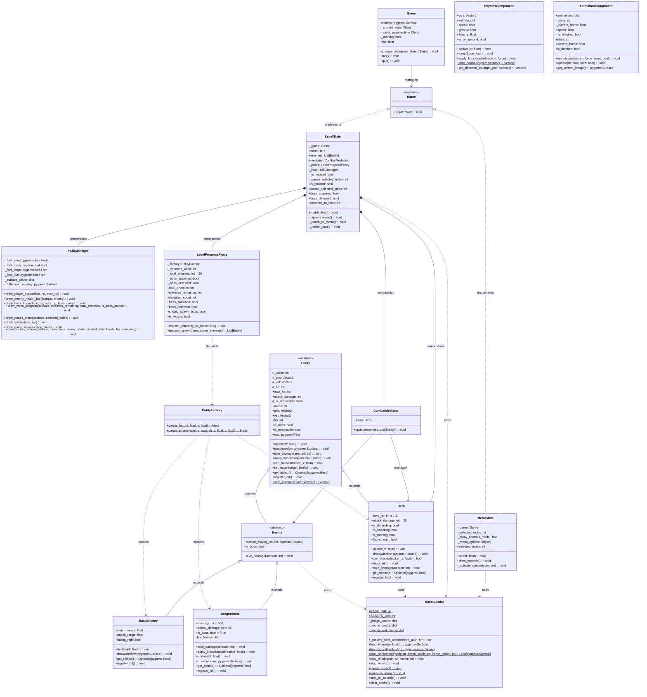

# 🏛️ Castle Night - Diagrama de Classes UML (Arquitetura SOLID / GoF)

Este documento contém o diagrama de classes UML oficial do projeto **Castle Night**, refletindo com precisão todos os módulos, entidades, padrões de projeto e contratos de interface implementados no código-fonte.

---

