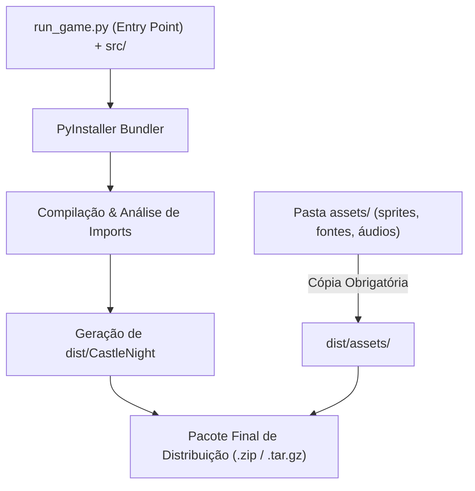

# 📦 Castle Night — Guia Definitivo de Compilação e Distribuição

<div align="center">

[](https://www.python.org/)
[](https://pyinstaller.org/)
[](https://www.pygame.org/)
[](https://github.com/ribeirorafadev/Castle-Night-Pygame)
[](../LICENSE)

**Instruções passo a passo para empacotamento, resolução de caminhos, distribuição de assets e troubleshooting de executáveis binários autônomos (*standalone*).**

</div>

---

## 📑 Sumário

- [Visão Geral da Arquitetura de Build](#-visão-geral-da-arquitetura-de-build)
- [Regras Fundamentais e Alertas Críticos](#-regras-fundamentais-e-alertas-críticos)
- [Passo 1: Preparação do Ambiente Virtual (venv)](#-passo-1-preparação-do-ambiente-virtual-venv)
  - [Windows (PowerShell / CMD)](#windows-powershell--prompt-de-comando)
  - [Linux (Bash / Zsh)](#linux-ubuntu--debian--fedora--arch)
  - [macOS (Terminal / Zsh)](#macos-terminal--zsh)
- [Passo 2: Processo de Compilação com PyInstaller](#-passo-2-processo-de-compilação-com-pyinstaller)
  - [Comando Canônico de Build](#comando-canônico-de-build)
  - [Tabela Detalhada de Flags](#tabela-detalhada-de-flags)
  - [Artefatos Gerados](#artefatos-gerados)
- [Passo 3: Estruturação e Distribuição dos Assets](#-passo-3-estruturação-e-distribuição-dos-assets)
  - [Arquitetura do AssetLoader](#arquitetura-do-assetloader)
  - [Estrutura de Pastas do Release](#estrutura-de-pastas-do-release)
  - [Comandos para Cópia de Assets](#comandos-para-cópia-de-assets)
- [Passo 4: Scripts de Automação de Build](#-passo-4-scripts-de-automação-de-build)
- [🔧 Guia de Troubleshooting (Resolução de Problemas)](#-guia-de-troubleshooting-resolução-de-problemas)
- [✅ Checklist Pré-Release](#-checklist-pré-release)

---

## 🏗️ Visão Geral da Arquitetura de Build

O projeto **Castle Night** utiliza o **PyInstaller** para empacotar o interpretador Python, as bibliotecas vinculadas (Pygame, SDL2, bibliotecas C/C++) e todo o código-fonte em um único executável binário autônomo (*standalone*).

O fluxo de compilação e distribuição segue o pipeline abaixo:



---

## ⚠️ Regras Fundamentais e Alertas Críticos

> [!WARNING]
> ### Incompatibilidade de Cross-Compilation (Compilação Cruzada)
> O **PyInstaller NÃO realiza compilação cruzada (*cross-compilation*)**.
> - Se você deseja gerar um executável para **Windows (`.exe`)**, você **DEVE** executar o build dentro de um ambiente **Windows** (ou máquina virtual/Wine).
> - Se deseja um binário para **Linux**, o build deve ser executado no **Linux**.
> - Se deseja um binário para **macOS**, o build deve ser executado no **macOS**.

> [!IMPORTANT]
> ### Localização da Pasta de Assets em Produção
> Por decisão arquitetural do `AssetLoader`, as mídias (áudios, sprites, fontes) **NÃO** são embutidas dentro do binário monolítico com `--add-data`. 
> A pasta `assets/` **deve obrigatoriamente ser copiada e distribuída lado a lado com o executável** dentro do diretório `dist/`.

> [!NOTE]
> ### Resolução Dinâmica de Caminhos (`sys.frozen`)
> A classe `AssetLoader` (`src/utils/asset_loader.py`) detecta automaticamente se o jogo está sendo executado a partir do interpretador Python puro ou através de um binário congelado pelo PyInstaller:
> ```python
> if getattr(sys, 'frozen', False):
>     BASE_DIR = os.path.dirname(sys.executable)
> else:
>     BASE_DIR = os.path.abspath(os.path.join(os.path.dirname(__file__), '..', '..'))
> ASSETS_DIR = os.path.join(BASE_DIR, 'assets')
> ```
> Isso garante portabilidade total e facilidade para modding de sprites e sons sem necessidade de recompilação do código-fonte.

> [!TIP]
> ### Builds Limpos e Reprodutíveis
> Sempre compile a partir de um ambiente virtual limpo (`.venv`) contendo apenas as dependências declaradas em `requirements.txt`. Isso evita que bibliotecas não utilizadas sejam embutidas no binário final, reduzindo o tamanho do executável de centenas de megabytes para o tamanho estritamente necessário.

---

## 🚀 Passo 1: Preparação do Ambiente Virtual (venv)

Recomendamos utilizar o **Python 3.12+** (mínimo suportado: Python 3.8+).

### Windows (PowerShell / Prompt de Comando)

1. **Abra o terminal na raiz do projeto:**
   ```powershell
   cd /caminho/para/Castle-Night-Pygame
   ```

2. **Crie o ambiente virtual:**
   ```powershell
   python -m venv .venv
   ```

3. **Ative o ambiente virtual:**
   - **No PowerShell:**
     ```powershell
     # Se ocorrer erro de política de execução, execute antes:
     # Set-ExecutionPolicy -Scope Process -ExecutionPolicy Bypass
     .\.venv\Scripts\Activate.ps1
     ```
   - **No Prompt de Comando (CMD):**
     ```cmd
     .\.venv\Scripts\activate.bat
     ```

4. **Instale as dependências:**
   ```powershell
   python -m pip install --upgrade pip
   pip install -r requirements.txt
   ```

---

### Linux (Ubuntu / Debian / Fedora / Arch)

1. **Instale os utilitários de venv se necessário:**
   - *Ubuntu / Debian:* `sudo apt update && sudo apt install python3-venv python3-pip -y`
   - *Fedora:* `sudo dnf install python3-virtualenv python3-pip -y`
   - *Arch Linux:* `sudo pacman -S python-virtualenv python-pip`

2. **Crie e ative o ambiente virtual:**
   ```bash
   python3 -m venv .venv
   source .venv/bin/activate
   ```

3. **Instale as dependências:**
   ```bash
   pip install --upgrade pip
   pip install -r requirements.txt
   ```

---

### macOS (Terminal / Zsh)

1. **Crie e ative o ambiente virtual:**
   ```bash
   python3 -m venv .venv
   source .venv/bin/activate
   ```

2. **Instale as dependências:**
   ```bash
   pip install --upgrade pip
   pip install -r requirements.txt
   ```

3. **Verifique se o PyInstaller está disponível:**
   ```bash
   pyinstaller --version
   ```

---

## ⚙️ Passo 2: Processo de Compilação com PyInstaller

Com o ambiente virtual ativado e todas as dependências instaladas, execute o empacotamento a partir da **raiz do projeto**.

### Comando Canônico de Build

Utilizamos `run_game.py` como ponto de entrada (*Entry Point*) principal para que todo o grafo de importações da pasta `src/` seja mapeado:

```bash
pyinstaller --noconsole --onefile --name "CastleNight" --hidden-import pygame run_game.py
```

---

### Tabela Detalhada de Flags

| Flag | Forma Abreviada | Propósito e Comportamento no Castle Night |
| :--- | :--- | :--- |
| `--noconsole` | `-w` / `--windowed` | **Oculta o console/terminal preto em segundo plano**. Essencial para jogos com interface gráfica Pygame, oferecendo uma experiência limpa e profissional ao jogador sem abrir prompts de linha de comando. |
| `--onefile` | `-F` | **Empacota todo o código Python, runtime e bibliotecas em um único binário executável**. Facilita a distribuição e evita expor dezenas de arquivos `.pyc` ou DLLs soltas na pasta de saída. |
| `--name "CastleNight"` | `-n` | **Define o nome final do artefato gerado** (`dist/CastleNight.exe` no Windows ou `dist/CastleNight` no Linux/macOS) e do arquivo de especificação (`CastleNight.spec`). |
| `--hidden-import pygame` | N/A | **Força a inclusão explícita de todos os submódulos C e hooks do Pygame** (`pygame.mixer`, `pygame.font`, `pygame.image`, `pygame.display`), prevenindo erros de carregamento dinâmico em tempo de execução. |
| `--clean` *(opcional)* | N/A | Limpa o cache de compilações anteriores do PyInstaller antes de gerar o novo build, garantindo uma compilação 100% fresca. |
| `--icon <caminho>` *(opcional)* | `-i` | Permite associar um arquivo de ícone customizado (`.ico` para Windows ou `.icns` para macOS) ao executável final. |

---

### Artefatos Gerados

Ao término do comando, o PyInstaller criará as seguintes estruturas na raiz:

```
Castle-Night-Pygame/
├── build/                 # Arquivos intermediários de compilação (pode ser excluído)
├── dist/                  # Diretório contendo o executável final compilado
│   └── CastleNight.exe    # (No Windows) ou 'CastleNight' (Linux/macOS)
└── CastleNight.spec       # Arquivo de especificação de build para reutilização
```

---

## 📂 Passo 3: Estruturação e Distribuição dos Assets

Para que o jogo inicialize corretamente e encontre todos os elementos visuais e sonoros (músicas de fundo, efeitos de combate, fontes medievais e spritesheets), a pasta `assets/` **deve ser copiada para dentro de `dist/`**, ficando no mesmo nível hierárquico do executável.

### Arquitetura do AssetLoader

O módulo `AssetLoader` resolve as rotas relativas combinando o diretório de execução com o caminho interno de cada recurso:

```
[Executável] dist/CastleNight.exe (Windows) ou dist/CastleNight (Linux/macOS)
[Diretório Base] dist/
[Diretório Assets] dist/assets/
├── audio/   -> dist/assets/audio/
└── sprites/ -> dist/assets/sprites/
```

---

### Estrutura de Pastas do Release

A pasta final de distribuição para envio aos jogadores deve possuir a seguinte estrutura:

```
dist/
├── CastleNight.exe          # (No Windows) ou 'CastleNight' (no Linux/macOS)
└── assets/
    ├── audio/
    │   ├── Attack-Boss.mp3
    │   ├── Attack-Sword-Hero.mp3
    │   ├── Attack-Sword-Enemy.mp3
    │   ├── Death-boss.mp3
    │   ├── Death-hero.mp3
    │   ├── Defend-Hero.mp3
    │   ├── Sound-Boss.mp3
    │   ├── Sound-Menu.mp3
    │   └── Sound-Normal.mp3
    └── sprites/
        ├── background/
        │   ├── Background.png
        │   ├── Floor.png
        │   ├── Menu.png
        │   ├── Mountains.png
        │   └── ...
        ├── enemies/
        │   ├── boss-dragon/
        │   ├── minotaur/
        │   ├── skeleton/
        │   ├── werewolf/
        │   ├── wizard/
        │   └── yokai/
        └── hero/
            ├── Attack 1.png
            ├── Attack 2.png
            ├── Dead.png
            ├── Defend.png
            ├── Hurt.png
            ├── Idle.png
            ├── Jump.png
            ├── Run.png
            ├── Run+Attack.png
            └── Walk.png
```

---

### Comandos para Cópia de Assets

Após a compilação pelo PyInstaller, execute o comando correspondente ao seu sistema operacional:

#### No Linux / macOS:
```bash
# Copia recursivamente a pasta assets para dentro de dist/
cp -r assets dist/
```

#### No Windows (PowerShell):
```powershell
Copy-Item -Path "assets" -Destination "dist\assets" -Recurse -Force
```

#### No Windows (Prompt de Comando - CMD):
```cmd
xcopy assets dist\assets /E /I /Y
```

---

## 🤖 Passo 4: Scripts de Automação de Build

Para maior comodidade e agilidade durante o ciclo de desenvolvimento e releases, você pode criar scripts automatizados para executar todas as etapas com um único comando.

### Script para Linux / macOS (`build.sh`)

```bash
#!/usr/bin/env bash
set -e

echo "=========================================="
echo "🏰 Compilando Castle Night com PyInstaller"
echo "=========================================="

# 1. Ativar venv se existir
if [ -d ".venv" ]; then
    source .venv/bin/activate
fi

# 2. Executar compilação limpa
pyinstaller --clean --noconsole --onefile --name "CastleNight" --hidden-import pygame run_game.py

# 3. Copiar assets lado a lado com o binário
echo "📦 Copiando pasta assets/ para dist/..."
cp -r assets dist/

# 4. Ajustar permissão de execução
chmod +x dist/CastleNight

echo "=========================================="
echo "✅ Build concluído com sucesso em: dist/"
echo "=========================================="
```

---

### Script para Windows (`build.ps1`)

```powershell
Write-Host "==========================================" -ForegroundColor Cyan
Write-Host "🏰 Compilando Castle Night com PyInstaller" -ForegroundColor Cyan
Write-Host "==========================================" -ForegroundColor Cyan

# 1. Ativar venv se existir
if (Test-Path ".\.venv\Scripts\Activate.ps1") {
    .\.venv\Scripts\Activate.ps1
}

# 2. Executar compilação limpa
pyinstaller --clean --noconsole --onefile --name "CastleNight" --hidden-import pygame run_game.py

# 3. Copiar assets lado a lado com o executável
Write-Host "📦 Copiando pasta assets/ para dist/..." -ForegroundColor Yellow
Copy-Item -Path "assets" -Destination "dist\assets" -Recurse -Force

Write-Host "==========================================" -ForegroundColor Green
Write-Host "✅ Build concluído com sucesso em: dist/" -ForegroundColor Green
Write-Host "==========================================" -ForegroundColor Green
```

---

## 🔧 Guia de Troubleshooting (Resolução de Problemas)

Abaixo estão listadas as falhas mais frequentes durante a compilação ou execução de binários empacotados, acompanhadas de suas respectivas soluções:

### 1. Áudio / Mixer (`pygame.error: mixer not initialized` ou falha no ALSA/PulseAudio)
- **Sintoma:** O jogo trava ao tentar tocar a trilha sonora ou efeitos sonoros.
- **Causa:** O backend de áudio do SDL2 não conseguiu se conectar ao servidor de som do sistema operacional.
- **Soluções:**
  - **Linux:** Verifique se as bibliotecas de som do SDL2 estão instaladas:
    ```bash
    sudo apt install libsdl2-mixer-2.0-0 pulseaudio alsa-utils -y
    ```
  - Caso o sistema use PipeWire ou ALSA direto, force a variável de ambiente antes de executar:
    ```bash
    SDL_AUDIODRIVER=pulseaudio ./dist/CastleNight
    # ou
    SDL_AUDIODRIVER=alsa ./dist/CastleNight
    ```

---

### 2. Assets não Encontrados (`FileNotFoundError: No such file or directory: 'assets/...'`)
- **Sintoma:** O jogo fecha abruptamente nos primeiros milissegundos após o clique de inicialização.
- **Causa:** A pasta `assets/` não foi copiada para dentro do diretório `dist/` onde reside o binário.
- **Solução:** Copie a pasta `assets/` da raiz do projeto para dentro da pasta `dist/`, exatamente ao lado do executável (`dist/assets/`).

---

### 3. Permissão Negada no Linux / macOS (`bash: ./CastleNight: Permission denied`)
- **Sintoma:** O terminal impede a execução do arquivo binário compilado.
- **Causa:** O sistema de arquivos removeu ou não atribuiu a flag de permissão de execução ao binário gerado.
- **Solução:** Conceda permissão de execução via `chmod`:
  ```bash
  chmod +x dist/CastleNight
  ```

---

### 4. Bloqueio de Falso Positivo (Windows Defender / SmartScreen)
- **Sintoma:** O Windows exibe a tela azul de aviso: *"O Windows protegeu o seu computador"*.
- **Causa:** Executáveis empacotados por PyInstaller sem certificado de assinatura digital (*Code Signing*) são frequentemente marcados preventivamente por heurística de segurança.
- **Solução:**
  - Clique em **"Mais informações"** e selecione **"Executar assim mesmo"**.
  - Para builds comerciais ou acadêmicas públicas, recomenda-se assinar o binário ou empacotá-lo em um arquivo `.zip` com instalador padrão.

---

### 5. Bloqueio do Gatekeeper no macOS (*"CastleNight não pode ser aberto porque provém de um desenvolvedor não identificado"*)
- **Sintoma:** O macOS impede a execução ao clicar no executável.
- **Causa:** Política de quarentena de aplicativos não assinados pelo Apple Developer ID.
- **Solução:**
  - Abra o terminal e remova o atributo de quarentena do binário:
    ```bash
    xattr -d com.apple.quarantine dist/CastleNight
    ```
  - Ou acesse *Preferências do Sistema > Segurança e Privacidade* e clique em *Permitir mesmo assim*.

---

### 6. Como Depurar Falhas Silenciosas em Produção
- **Sintoma:** O executável fecha sem exibir nenhuma mensagem de erro ou janela.
- **Causa:** A flag `--noconsole` suprime a exibição de *tracebacks* de exceções do Python no terminal.
- **Solução:**
  - Execute o binário diretamente via terminal para inspecionar as mensagens de erro:
    - **No Windows (PowerShell/CMD):** `.\dist\CastleNight.exe`
    - **No Linux/macOS:** `./dist/CastleNight`
  - Se necessário, gere um build temporário de depuração **sem** a flag `--noconsole`:
    ```bash
    pyinstaller --onefile --name "CastleNight_Debug" --hidden-import pygame run_game.py
    ```

---

### 7. Conflito de Versões de GLIBC no Linux
- **Sintoma:** Ao executar o binário em outra máquina Linux, ocorre o erro `version 'GLIBC_2.xx' not found`.
- **Causa:** O binário foi compilado em uma distribuição com versão de `glibc` mais recente do que a máquina de destino.
- **Solução:** Para distribuição universal no Linux, compile o jogo dentro de um container Docker ou máquina virtual baseada em uma distribuição com suporte de longo prazo (ex: Ubuntu 20.04 ou Debian OldStable).

---

## ✅ Checklist Pré-Release

Antes de disponibilizar o pacote final de **Castle Night** para os jogadores ou avaliadores, certifique-se de cumprir todas as etapas:

- [ ] O jogo foi testado e executa normalmente via `python run_game.py`.
- [ ] O comando de compilação do PyInstaller concluiu sem erros de dependência.
- [ ] A pasta `assets/` foi copiada para dentro de `dist/` com todas as subpastas (`audio/`, `sprites/`).
- [ ] O executável em `dist/` foi testado em um diretório isolado fora da raiz do projeto.

- [ ] A trilha sonora e os efeitos de espada, impacto, pulo e dragão tocam com nitidez.
- [ ] O menu de pausa (`ESC`), combate, animações e barra de vida do Boss funcionam a 60 FPS estáveis.
- [ ] O diretório `dist/` foi compactado em formato `.zip` (para Windows) ou `.tar.gz` (para Linux) para envio.

---

<div align="center">
  <sub>Documentação Técnica do Projeto <b>Castle Night</b> — Bacharelado em Engenharia de Software.</sub>
</div>
